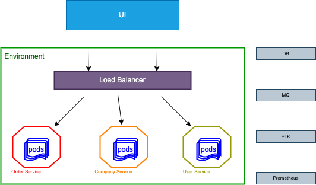

## Системная архитектура
Представляет собой набор из 3 микросервисов:
1. Order service - сервис заказов услуг
2. Company service - сервис описания спортивных комплексов
3. User service - сервис по хранению данных пользователей
   

## Микро-архитектура приложения
Представляет собой модульную архитектуру

## Описание сущностей

Order
* Id
* CompanyId
* UserId
* ServiceId
* Date
* Address

Company
* Id
* Name
* Description
* Address

Service
* Id
* CompanyId
* Description
* Cost

User
* Id
* Name
* Phone